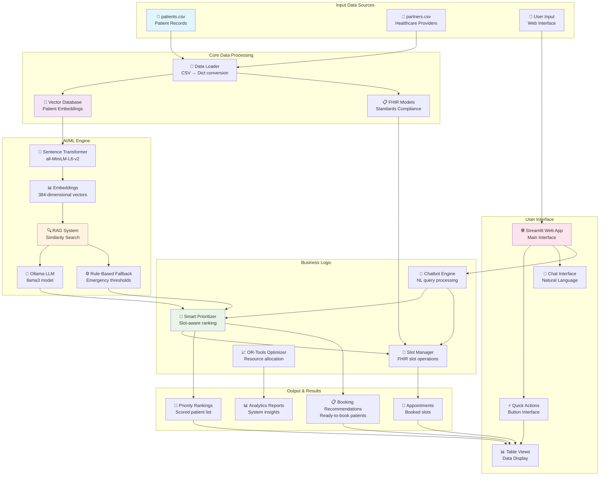
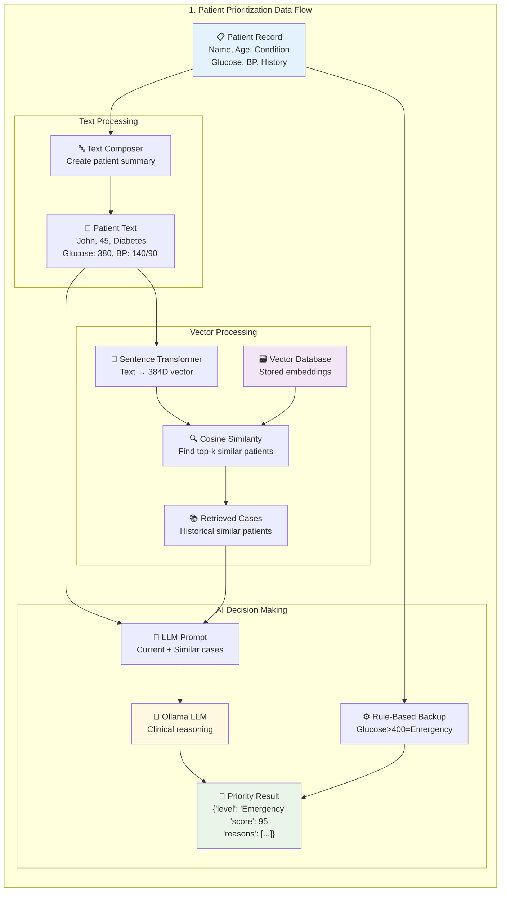
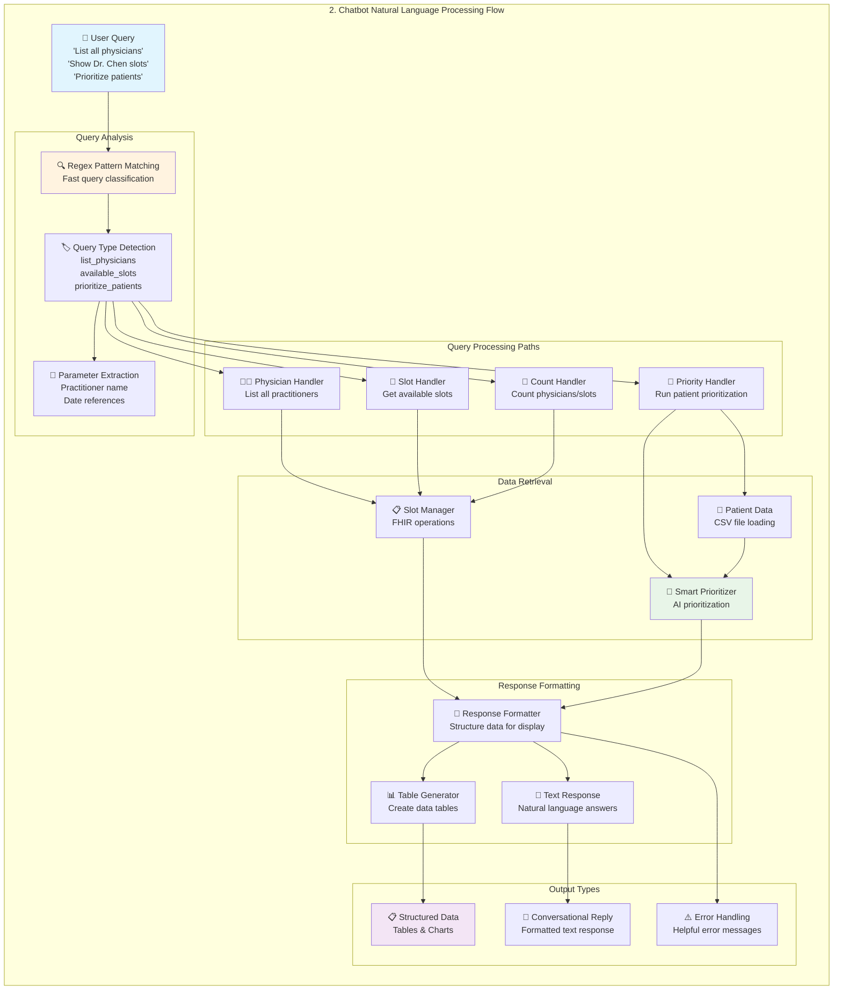
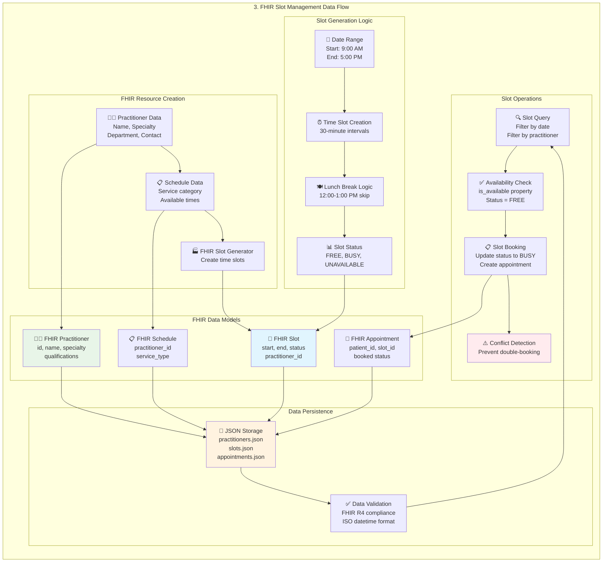
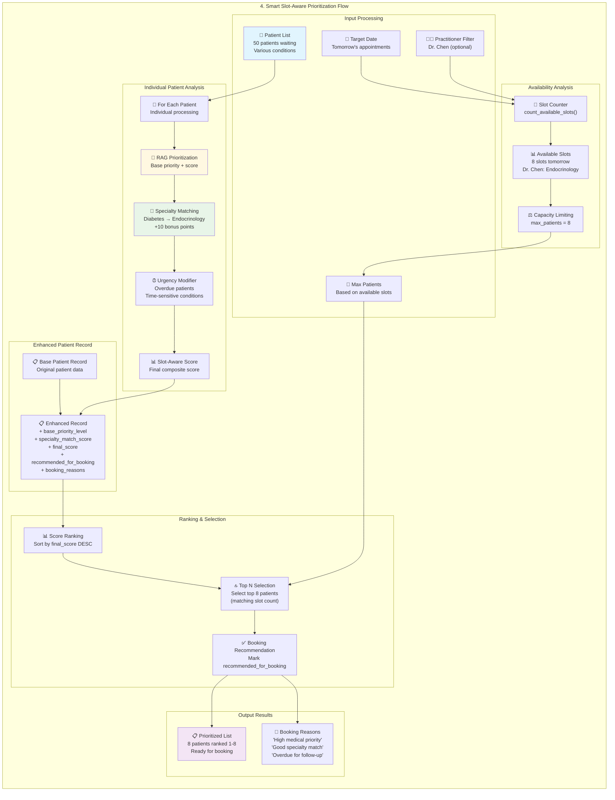
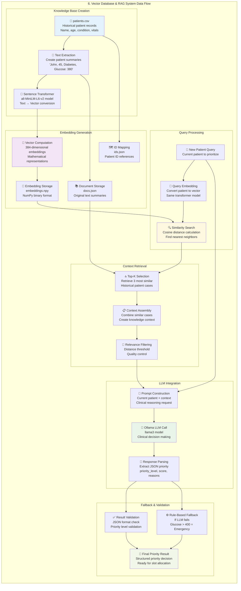
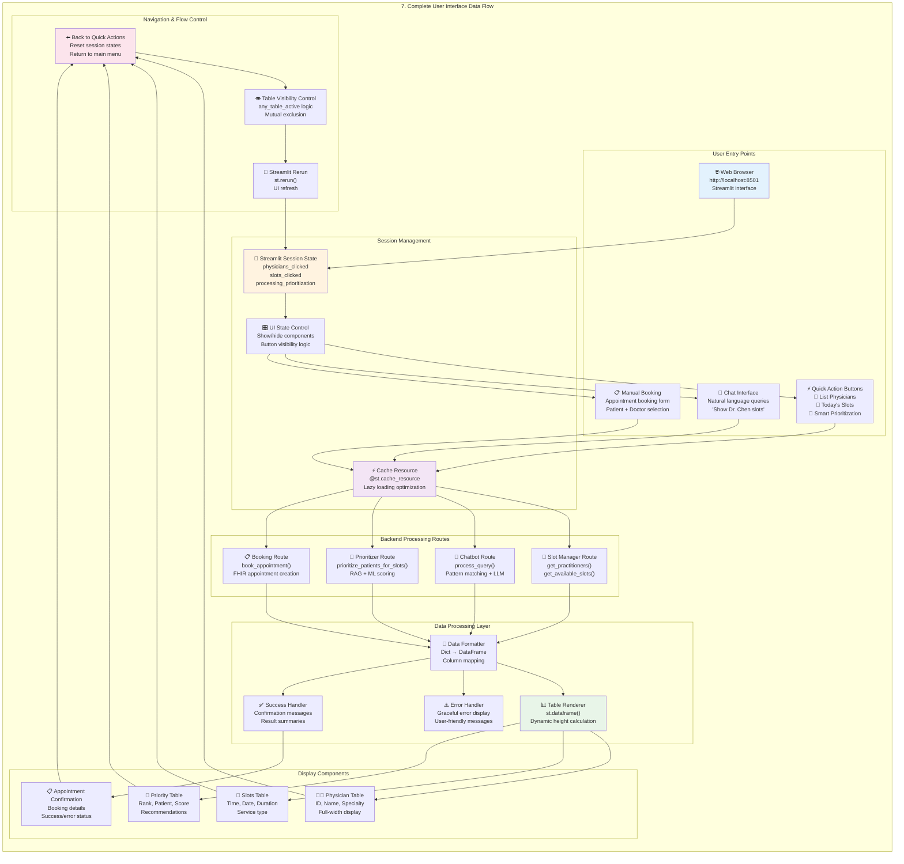

# 🛠️ VisitIQ - Technical Documentation
## Healthcare Visit Prioritization System

### **Architecture Overview**
VisitIQ is a comprehensive healthcare scheduling and prioritization system built with modern AI/ML technologies and FHIR R4 compliance. The system uses a microservices-like architecture with modular components.

```
┌─────────────────┐    ┌─────────────────┐    ┌─────────────────┐
│   Web Frontend  │    │   AI Chatbot    │    │  FHIR Backend   │
│   (Streamlit)   │◄──►│   (LangChain)   │◄──►│  (Slot Manager) │
└─────────────────┘    └─────────────────┘    └─────────────────┘
         ▲                       ▲                       ▲
         │                       │                       │
         ▼                       ▼                       ▼
┌─────────────────┐    ┌─────────────────┐    ┌─────────────────┐
│ Smart Prioritizer│    │ Vector Database │    │ FHIR Data Models│
│  (RAG + ML)     │◄──►│ (Embeddings +   │◄──►│ (Healthcare     │
│                 │    │  Similarity)    │    │  Standards)     │
└─────────────────┘    └─────────────────┘    └─────────────────┘
```

---

## 📁 **File Structure & Components**

### **Core Application Files**

#### **1. `enhanced_app.py`** - Main Streamlit Application
- **Purpose**: Primary web interface and UI orchestration
- **Technologies**: Streamlit, Pandas, Python
- **Key Features**:
  - Lazy loading with `@st.cache_resource` for performance optimization
  - Session state management for UI interactions
  - Professional healthcare-focused UI design
  - Three main interaction modes: Quick Actions, AI Chatbot, Manual Scheduling

**Key Code Patterns:**
```python
@st.cache_resource
def get_slot_manager_cached():
    return get_slot_manager()  # Lazy initialization

# Session state for UI control
if st.session_state.get('physicians_clicked', False):
    # Render physician table outside column constraints
```

#### **2. `src/chatbot.py`** - Natural Language Interface
- **Purpose**: Conversational AI for healthcare queries
- **Technologies**: LangChain, Ollama LLM, Regex Pattern Matching
- **Architecture**: Hybrid approach with regex fallback

**Query Processing Pipeline:**
```python
def process_query(self, query: str) -> Dict[str, Any]:
    # 1. Pattern matching (fast)
    # 2. LLM processing (if available)  
    # 3. Structured response formatting
```

**Supported Query Types:**
- `list_physicians` - "List all physicians"
- `physician_count` - "How many physicians do you have?"
- `available_slots` - "Show available slots for Dr. Chen"
- `prioritize_patients` - "Prioritize patients for Dr. Rodriguez"

#### **3. `src/smart_prioritizer.py`** - Slot-Aware AI Prioritization
- **Purpose**: Context-aware patient prioritization considering available slots
- **Technologies**: RAG (Retrieval Augmented Generation), ML scoring
- **Key Innovation**: Combines medical urgency with slot availability

**Prioritization Algorithm:**
```python
def prioritize_patients_for_slots(self, patients, practitioner_id=None):
    # 1. Get base priority from RAG system
    priority_result = rag_prioritize_row(patient)
    
    # 2. Apply slot-aware scoring
    slot_aware_score = base_weight + base_score + specialty_match + urgency_modifier
    
    # 3. Sort by final score and select top N for available slots
```

#### **4. `src/prioritizer.py`** - RAG-Based Priority Engine
- **Purpose**: Core ML/AI prioritization using semantic similarity
- **Technologies**: Sentence Transformers, scikit-learn, Ollama LLM
- **Architecture**: Local vector store with persistent embeddings

**RAG Implementation:**
```python
# Vector Storage
EMBEDDINGS_FILE = "embeddings.npy"  # NumPy array of embeddings
DOCS_FILE = "docs.json"            # Patient documents as text
IDS_FILE = "ids.json"              # Patient IDs

# Similarity Search
def _query_similar_docs(query_text: str, k: int = 3):
    # 1. Embed query using sentence-transformers
    # 2. Use NearestNeighbors (cosine similarity) 
    # 3. Return top-k similar patient records
```

**LLM Integration:**
```python
def rag_prioritize_row(row: Dict) -> Dict:
    # 1. Retrieve similar patient cases from vector store
    docs = _query_similar_docs(patient_text, k=3)
    
    # 2. Create LLM prompt with context
    prompt = f"Patient: {patient_text}\nSimilar Cases: {retrieved_text}"
    
    # 3. Get structured JSON response from Ollama
    # 4. Fallback to rule-based if LLM fails
```

#### **5. `src/fhir_models.py`** - Healthcare Data Standards
- **Purpose**: FHIR R4 compliant data models
- **Technologies**: Python dataclasses, Enums, datetime handling
- **Standards Compliance**: Full FHIR resource modeling

**FHIR Resources Implemented:**
```python
@dataclass
class FHIRPractitioner:    # Healthcare provider info
@dataclass  
class FHIRSchedule:        # When practitioner is available
@dataclass
class FHIRSlot:           # Specific bookable time slots
@dataclass
class FHIRAppointment:    # Booked patient appointments
```

**Key Features:**
- Automatic slot generation with lunch breaks
- Status management (FREE, BUSY, etc.)
- ISO datetime serialization
- Validation and data integrity

#### **6. `src/slot_manager.py`** - FHIR Slot Orchestration
- **Purpose**: Manages all slot-related operations and FHIR resource coordination
- **Technologies**: FHIR models, datetime processing, JSON persistence
- **Key Operations**: Slot creation, availability checking, appointment booking

### **Configuration & Deployment Files**

#### **`enhanced_requirements.txt`** - Python Dependencies
```
streamlit>=1.28.0          # Web framework
pandas>=2.0.0              # Data manipulation
sentence-transformers      # ML embeddings
scikit-learn              # Machine learning
langchain-ollama          # LLM integration  
numpy                     # Numerical computing
```

#### **`visitiq.sh`** - Application Management Script
```bash
./visitiq.sh start    # Start the application
./visitiq.sh stop     # Stop all services
./visitiq.sh restart  # Restart application
./visitiq.sh status   # Check system health
```

#### **Docker Configuration**
- `Dockerfile.enhanced` - Main application container
- `enhanced_docker-compose.yml` - Multi-service orchestration
- `llm/Dockerfile.llm` - Ollama LLM service container

### **Data Storage & Persistence**

#### **Vector Database (`chroma_db/`)**
```
chroma_db/
├── embeddings.npy        # Patient record embeddings (ML vectors)
├── docs.json            # Patient documents as text
├── ids.json             # Patient ID mappings
```

**Storage Pattern:**
- **Embeddings**: 384-dimensional vectors from sentence-transformers
- **Documents**: Structured patient text for RAG context
- **Persistence**: NumPy binary + JSON for fast loading

#### **Sample Data (`data/`)**
- `patients.csv` - Sample patient records with medical conditions
- `partners.csv` - Healthcare provider information

---

## 🧠 **AI/ML Technologies Deep Dive**

### **1. Sentence Transformers (all-MiniLM-L6-v2)**
```python
# Convert patient records to 384-dim vectors
model = SentenceTransformer('all-MiniLM-L6-v2')
embeddings = model.encode(patient_texts)

# Patient record example:
"Patient ID: 001. Name: John Doe. Age: 45. Condition: Type 2 Diabetes. 
Vitals: Glucose 380; BP 140/90; HR 78. History: Family diabetes history."
```

### **2. Vector Similarity Search**
```python
# Use cosine similarity for finding similar patients
nn = NearestNeighbors(n_neighbors=3, metric="cosine")
nn.fit(stored_embeddings)
distances, indices = nn.kneighbors(query_embedding)
```

### **3. Ollama LLM Integration**
```python
# LLM prompt for clinical decision making
prompt = f"""
You are a clinical assistant. Use patient record and similar cases to decide priority.
Return JSON: {{"priority_level": "High", "score": 85, "reasons": ["glucose >350"]}}

Patient: {current_patient}
Similar Cases: {retrieved_contexts}
"""
```

### **4. Rule-Based Fallback System**
```python
# Emergency thresholds when LLM unavailable
EMERGENCY_GLUCOSE = 400      # mg/dL
HIGH_BP_SYSTOLIC = 180      # mmHg  
HIGH_BP_DIASTOLIC = 110     # mmHg

def rule_based_priority_row(patient_data):
    if patient_data['glucose_mg_dL'] > EMERGENCY_GLUCOSE:
        return {"priority_level": "Emergency", "score": 100}
```

---

## 🔧 **Performance Optimizations**

### **1. Lazy Loading Pattern**
```python
@st.cache_resource
def get_components():
    # Only initialize heavy ML components when needed
    # Cached across Streamlit reruns
    return slot_manager, prioritizer, chatbot
```

### **2. Session State Management**
```python
# Efficient UI state control
if not any([st.session_state.get('physicians_clicked', False),
           st.session_state.get('slots_clicked', False)]):
    # Only render buttons when no table active
```

### **3. Dynamic Table Rendering**
```python
# Responsive table heights based on data
dynamic_height = min(len(df) * 35 + 50, 400)
st.data_editor(df, height=dynamic_height)
```

### **4. Vector Database Optimization**
- **Persistent embeddings** - Pre-computed and stored as NumPy arrays
- **Fast similarity search** - scikit-learn NearestNeighbors with cosine metric
- **Minimal memory footprint** - JSON + binary storage

---

## 🏗️ **Development Patterns & Best Practices**

### **Error Handling Strategy**
```python
# Graceful LLM fallbacks
try:
    llm_result = call_ollama(prompt)
    return parse_json_response(llm_result)
except Exception:
    return rule_based_fallback(patient_data)
```

### **FHIR Compliance Patterns**
```python
# Proper FHIR resource serialization
def to_dict(self) -> Dict[str, Any]:
    data = asdict(self)
    data['start'] = self.start.isoformat()  # ISO 8601
    data['status'] = self.status.value      # Enum to string
    return data
```

### **UI State Management**
```python
# Clean session state control
def reset_all_table_states():
    st.session_state.physicians_clicked = False
    st.session_state.slots_clicked = False  
    st.session_state.processing_prioritization = False
```

---

## 🚀 **Deployment Architecture**

### **Local Development**
```bash
# Native Python environment
python -m venv venv
source venv/bin/activate
pip install -r enhanced_requirements.txt
streamlit run enhanced_app.py --server.port 8501
```

### **Docker Production**
```yaml
# enhanced_docker-compose.yml
services:
  app:
    build: .
    ports: ["8501:8501"]
    depends_on: [ollama]
    
  ollama:
    image: ollama/ollama
    ports: ["11434:11434"]
    command: ["serve", "llama3"]
```

### **Scaling Considerations**
- **Stateless design** - All state in session/database
- **Microservice ready** - Modular component architecture
- **EHR integration points** - FHIR-compliant data exchange
- **Horizontal scaling** - Vector database can be distributed

---

## 📊 **Data Flow Diagrams**

This section provides comprehensive visual representations of how data flows through different components of the VisitIQ system.

### **1. Overall System Architecture Flow**



### **2. Patient Prioritization Data Flow**



### **3. Chatbot Natural Language Processing Flow**



### **4. FHIR Slot Management Data Flow**



### **5. Smart Slot-Aware Prioritization Flow**



### **6. Appointment Booking Process Flow**

```mermaid
flowchart TD
    subgraph "5. Appointment Booking Process Flow"
        direction TB
        
        subgraph "Booking Initiation"
            UserSelection["👤 User Selection<br/>Manual booking interface<br/>Select patient + practitioner"]
            PriorityRecommendation["🎯 Priority Recommendation<br/>From smart prioritization<br/>Recommended patients"]
            BookingTrigger["🚀 Booking Trigger<br/>Manual button click<br/>(Future: Auto-booking)"]
        end
        
        subgraph "Pre-Booking Validation"
            PatientLookup["👤 Patient Lookup<br/>Verify patient exists<br/>Get patient details"]
            PractitionerLookup["👨‍⚕️ Practitioner Lookup<br/>Verify doctor exists<br/>Check specialties"]
            DateValidation["📅 Date Validation<br/>Future date only<br/>Within 30-day window"]
        end
        
        subgraph "Slot Discovery"
            SlotQuery["🔍 Available Slot Query<br/>Filter by practitioner<br/>Filter by date"]
            SlotFiltering["🎯 Slot Filtering<br/>Status = FREE<br/>start > now()"]
            SlotPresentation["📋 Slot Presentation<br/>Time options display<br/>Duration information"]
        end
        
        subgraph "Slot Selection & Validation"
            SlotSelection["⏰ Slot Selection<br/>User picks time slot<br/>30-min appointment"]
            AvailabilityCheck["✅ Final Availability Check<br/>Ensure still FREE<br/>Prevent conflicts"]
            ConflictDetection["⚠️ Conflict Detection<br/>No double-booking<br/>Race condition handling"]
        end
        
        subgraph "Appointment Creation"
            FHIRAppointmentBuild["📝 FHIR Appointment Creation<br/>id: appt-slot-patient<br/>status: BOOKED<br/>start/end times"]
            SlotStatusUpdate["📊 Slot Status Update<br/>FREE → BUSY<br/>Link to appointment"]
            ReasonCapture["📝 Reason & Notes<br/>reason_code<br/>description"]
        end
        
        subgraph "Data Persistence"
            AppointmentStorage["💾 Appointment Storage<br/>Save to appointments.json<br/>FHIR compliant format"]
            SlotStorage["💾 Slot Update Storage<br/>Update slots.json<br/>Status change"]
            DataValidation["✅ Data Validation<br/>ISO datetime format<br/>FHIR R4 compliance"]
        end
        
        subgraph "Booking Confirmation"
            SuccessResponse["✅ Success Confirmation<br/>Appointment ID<br/>Date/Time display"]
            ErrorHandling["❌ Error Handling<br/>Slot unavailable<br/>Booking conflicts"]
            NotificationTrigger["📧 Notification Trigger<br/>(Future: Email/SMS)"]
        end
        
        UserSelection --> PatientLookup
        PriorityRecommendation --> PatientLookup
        BookingTrigger --> PatientLookup
        
        PatientLookup --> PractitionerLookup
        PractitionerLookup --> DateValidation
        DateValidation --> SlotQuery
        
        SlotQuery --> SlotFiltering
        SlotFiltering --> SlotPresentation
        SlotPresentation --> SlotSelection
        
        SlotSelection --> AvailabilityCheck
        AvailabilityCheck --> ConflictDetection
        ConflictDetection --> FHIRAppointmentBuild
        
        FHIRAppointmentBuild --> ReasonCapture
        ReasonCapture --> SlotStatusUpdate
        SlotStatusUpdate --> AppointmentStorage
        
        AppointmentStorage --> SlotStorage
        SlotStorage --> DataValidation
        DataValidation --> SuccessResponse
        
        ConflictDetection --> ErrorHandling
        AvailabilityCheck --> ErrorHandling
        SuccessResponse --> NotificationTrigger
        
        style PatientLookup fill:#e1f5fe
        style ConflictDetection fill:#ffebee
        style FHIRAppointmentBuild fill:#e8f5e8
        style SuccessResponse fill:#f1f8e9
    end
```



### **7. Vector Database & RAG System Data Flow**



### **8. Complete User Interface Data Flow**



### **Key Data Flow Insights**

#### **📊 Data Journey Overview:**
```
CSV Files → Vector Embeddings → AI Analysis → Priority Scores → 
Slot Matching → Booking Recommendations → User Interface → 
Manual/Auto Booking → FHIR Appointments
```

#### **🤖 AI Processing Pipeline:**
```
Patient Text → 384D Vector → Similarity Search → 
Historical Cases → LLM Reasoning → Priority Decision → 
Slot-Aware Ranking → Booking Recommendations
```

#### **🎯 Smart Features Flow:**
```
Natural Language Query → Pattern Recognition → 
Data Retrieval → Processing → Formatted Response → 
UI Display → User Action
```

#### **💡 System Architecture Benefits:**
- **Modular Design** - Clear separation of concerns between components
- **Data Persistence** - JSON storage with FHIR R4 compliance validation
- **Error Handling** - Graceful fallbacks at every processing level
- **Performance Optimization** - Caching and lazy loading throughout
- **User Experience** - Multiple interaction methods with consistent data flow

---

## 🔍 **Testing & Debugging**

### **Component Testing**
```python
# Test RAG prioritization
test_patient = {"name": "Test", "glucose_mg_dL": 450}
priority = rag_prioritize_row(test_patient)
assert priority['priority_level'] == 'Emergency'
```

### **Performance Monitoring**
- **Streamlit metrics** - Built-in performance dashboard
- **LLM response times** - Configurable timeouts (15s default)
- **Vector search latency** - Sub-millisecond similarity queries

### **Logging Strategy**
```python
# Structured logging for debugging
logger.info(f"Processing {len(patients)} patients for {practitioner_id}")
logger.debug(f"RAG retrieved {len(contexts)} similar cases")
```

---

## 📚 **Integration Points**

### **External Systems**
- **EHR/EMR Integration** - FHIR R4 API endpoints
- **Calendar Systems** - iCal/CalDAV export capability  
- **Notification Services** - Email/SMS appointment reminders
- **Analytics Platforms** - Usage metrics and optimization insights

### **API Design**
```python
# RESTful endpoints (future)
GET  /api/practitioners           # List all practitioners
POST /api/slots/search           # Find available slots
POST /api/patients/prioritize    # Run AI prioritization
POST /api/appointments           # Book appointment
```

---

## 🛠️ **Troubleshooting Guide**

### **Common Issues**

1. **Ollama Connection Failed**
   ```bash
   # Start Ollama service
   docker run -d -p 11434:11434 ollama/ollama
   ollama pull llama3
   ```

2. **Vector Database Not Found**
   ```python
   # Rebuild embeddings
   build_vectorstore_from_csv("data/patients.csv")
   ```

3. **Streamlit Performance Issues**
   ```python
   # Clear cache
   st.cache_resource.clear()
   ```

4. **FHIR Model Validation Errors**
   ```python
   # Check dataclass field order (non-default args first)
   ```

This technical documentation provides developers with complete understanding of the VisitIQ architecture, implementation patterns, and deployment strategies for maintaining and extending the healthcare prioritization system.
